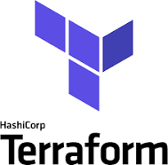
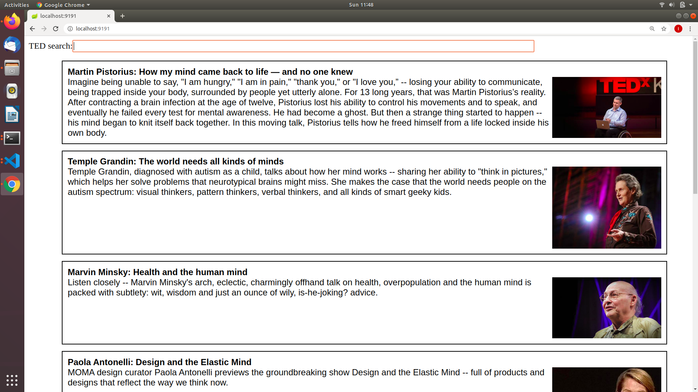

# How to set up a load balancer in two different availability zones on AWS cloud, using Terraform - 
This example will explain how to set up a load balancer (LB in short, or ALB which stands for Application Load Balancer) in the amazon web services (AWS) cloud. 
**While making this example, I take it you have no prior knowledge of Terraform. Therefore, I put many explanations in order to make the example as easy to learn and understand as possible** 

This example includes a directory named "terraform" which includes the terraform script named ```load_balancer.tf``` - this file include FULL EXPLANATIONS. 


### Run instructions - 
Download the ```terraform``` directory, then **cd to that directory** from the terminal and type ```terraform init && terraform apply``` . This will download all the necessary pluging needed and will start creating all the architecture defined in the Terraform script. The creation the architecture can take a few minutes because the launching of the EC2 instances can take a few minutes. 

Before running the script make sure to edit the file -  ./terraform/accessKeys.csv - enter the access key which will be used to acces Amazon Web Services (aws) . **Remember to keep that key secret, as anyone who is having it can login to your account and do actions under your identity.** 

This script was created and tested using Terraform v0.12 , other versions can show a little-bit different syntax. 

**A note - Make sure to destroy all resources by typing the command ```terraform destroy``` while in the terraform directory. Also connect physically to the aws console - and make sure no resource are left!**


## What is a load balancer? ( Technical background and definitions. ) 
A load balancer (LB in short) is a server which is used to forward traffic to multiple machines running the application. In other words, in order to prevent overload of the application, multiple copies of it are running on different servers. When the user approches the application, he is being proxy-forwarded to one of the copies. If one copy is overloaded. or crushes, then the Load Balancer will not forward the users to that specific server running the copy of the applications. Instead, it will forward the users to the other copies, resulting a continous use of the application, with a minimal fall-time for the users. 

AWS cloud currently offers a new type of load balancer called ALB, which stands for Apllication Load Balancer. The old service is called LB which is Load Balancer. This old service is still available though not as advanced as the ELB. In this example I will be using ELB as a Load Balancer. 

In AWS you need to define the three follow resources in order to make a functional ELB - 
* EC2 instances - this is AWS service of virtual machines, meaning making a server which can be used to run the application. In this example I will not actually create the EC2 instances, but instead I will make a "target group" which will create them. 
* Target group - this resource group all EC2 instances which will run the application. Also, this defines the application port and protocol access.  
* Auto-scaling group - this resource tells what should be the amount of EC2 instances which will be created on the cloud. There is a minimum amount, a mximum amount and a desired amount. 
    * minimum amount - what will be the minimal amount of EC2 instances on-air which will run the application. 
    * maximum amount - when there is an over-load on the target-group, the auto-scaling group will create more EC2 instances which will run the application. The maximum amount of EC2 instances will be set ehre. 
    * desired amount - this is the amount of EC2 instances which teh auto-scaling group will try to reach. If there are not enough EC2 instances, then the auto-scaling group will spin more of them. ("spin a server" is the slang in AWS for creating an EC2 instance) On the contrary, when there are too many EC2 instances, and there is no overload, then the auto-scaling group will terminate some of them. **Eventually, the auto-scaling group resource will try to reach the desired amount of EC2 instances defined to it.**
* Application Load Balancer - ALB - The load balancer (LB) will proxy-forward the users to one of the EC2 instances in the Target group. 
    * When setting an ELB - you need to mention the protocol and port which will be used to connect to the apllication. In this example it is HTTP protocl under port 9191 . 
    * Upon being set, the ELB will get a DNS address, and you will be able to surf to it. 
    * The ELB will accept your traffic and will proxy-forward your request to one of the EC2 instances. 
    * Interesting to know, the ELB service is based on nginx server, though you don't need to configure the ```.conf``` files of the nginx, Amazon will do that for you. 


Looking at their role - the target group will sum all the instances with the application, the auto-scaling group will do health-check and track the usage of the EC2 instances. When there is a need - the auto-scaling group will terminae or spin more EC2 instances. The application load balancer (ALB) will proxy-forward to EC2 instances, which are part of the target-group. 

In this example, I will be setting an auto-scaling group of ranging from 2-3 EC2 instances. (The desired capacity will be set to two EC2 instances) , linked to an ELB server. The halth check will try to sned a packet of data to each EC2 instance on port 9191 in protocl HTTP every 30 seconds. 

**Remember - Every EC2 instance which will run - will cost you cash! So put as much as you need! Also make sure to close any resource which is not in use, as you might will be paying for it.**


### Health checks - 
Health check is an important concept while working with load balancers. Every specified amount of time, every instance will be checked for connectivity. If the instance is having a problem the load balancer will stop proxy-forwarding to it. On that same time, the auto-scaling group service will terminate the failing EC2. As a consequence, the desried capacitiy of EC2 instances will smaller then needed - and this will result the auto-scale group to spin another EC2 instance. 
**AN IMPORTANT NOTE - If you want to destroy the resources created in this example, by trying to terminate all EC2 instances, then make sure to cancel the auto-scale group! If you will not cacel the auto-scale group, then it will spin new EC2 instances, which will return you to the former state. And of corse you will be paying for these..** 
***Actually what will happen is that the auto-scaling group will try to do the health check for the target group, failing of corse as the EC2 instances are terminated, and will assume there are problems with the EC2 instances and will make new one. ***


## Terraform - 
Terraform is an open-source infrastructure as code software tool created by HashiCorp. It enables users to define and provision a datacenter infrastructure using a high-level configuration language known as Hashicorp Configuration Language, or optionally JSON.




### The Terraform Version - 
The version of Terraform used in this example is v0.12 , which is the new version at Jan-2020 . 

Due to the fact that Terraform is a new technology, its version and syntax are changing often. Therefore, using a different version will might result a wrong syntax error. To check if the syntax of the Terraform script files (with .tf extension) use the command ```terraform validate``` on terminal while "cd" in the directory. 


### The terraform directory - 
All files used for the terraform script are located at the directory "terraform" . 
The main.tf file is the only file used by Terraform in order to run the script. 

To run the script - 
* You need to install the necessary plugin by typing - ```terraform init``` so all needed plugins will be donwloaded and placed in a hidden directory called "./terraform/plugins" . **Make sure to install the plugins first before launching the script**
* To check the validity of the Terraform script type - ```terraform validate```
* To see a "plan" which will show what Terraform will do by running the script run, type the command - ```terraform plan```
* To run the Terraform script by typing ```terraform apply``` . This will create all needed resources on the AWS cloud. 
* To destroy all created resources, e.g. to destroy the architecture, type - ```terraform destroy``` 

**REMEMBER** - The created resources cost cash! You will be paying for the running resources!!! So make sure to destroy the work using ```terraform destroy```, and check in the AWS console **itself** that there are no more resources. 


## The TED application - 
For this example, I will be using TED application. This application is a JAVA spring based web-application which queries the TED lectures' database and shows the results in a stylish way. 

The application requires Java JRE to be installed on the server running it. It uses a configuration file, and works on port 9191 . The application was compiled as a JAR file using maven. All source files are located under the directory ```TED-app``` . 

To run the application from your local machine type - 

```bash
nohup java -jar embedash-1.1-SNAPSHOT.jar --spring.config.location=./application.properties &
```
***This command will run the application in the background, and will be used by the Amazon Machine Image (AMI) used in this example. ***

To run the application while attached to the terminal type - 
```bash
java -jar embedash-1.1-SNAPSHOT.jar --spring.config.location=./application.properties #With the propeties file
java -jar embedash-1.1-SNAPSHOT.jar #Without the properties file - this will make the applicatino work on port 8181 
```

 


## The TED application AMI - 
For this example, I have made an Amazon machine instance (AMI) for the TED application. This AMI is basically a linux ubuntu OS, which its ```crontab``` file was configured to launch the TED application when it starts up. The AMI id is - ```ami-0ad4e8f13655edfef``` , and as writing this line, is still available in the AWS marketplace for public use. 

If by any case, this AMI is not available - you can pick whatever AMI id you want from the AWS Marketplace. Even better - you can make your's! The basic idea behind the AMI in this example is that when the instance is spun (spinning instance, the amazon slang for creating a new instance) it will launch the application automatic. In other words, make sure that when the instance will launch - it will make the application start up automatically and be listening on the desired port. ( In this example 9191 , though you can configure it in the terraform file under the terraform directory. ) 

**There are many ways to make you own AMI , but here are the general instructions**
1. Create an EC2 instance, and choose the template operating system you want. ( In my example it i Ubuntu. ) 
2. Copy the files of your application to the instance. You can do it using SSH connection and the ```scp``` terminal function. 
3. Configure the operating system to launch the application when it start-up, or every period of time. ( In my case I used ```crontab``` file. ) 
Now here is the important part - 
4. When creating an AMI you basically take an "image" of your system, like a snapshot. To do this in AWS cloud go to the console, right click on the instance and choose to make an image for it. 
5. Please note that some of the options you choose can effect the cost of the image, and the cost of storing the AMI in Amazon. SO PUT YOU'R ATTENTION ON IT! 


### The importance of making the AMI - 
As said in the above paragraphs, the load balancer is proxy-forwarding to target group, which groups all EC2 instances running the application. (In this example TED application. ) the auto-scaling group will terminate or spin more EC2 instances as needed, according to the three attributes: min amount, max amount and the desired capacity. 

The auto-scaling just know to trigger the creationg of an EC2 instance, but it cannot configure it. Hence, it can not do the bash commands required to run the application. By defining an AMI, you can pre-configure the OS to launch the application for you. And that is actually the solution for the problem - the auto-scaling group will just spin the EC2 instance, and the instance by itself will have all needed files and configurations needed in order to make the application running. 


## Testing and understanding the concepts 
**Try the load balancer:**
  * Enter the aws console and choose "load balancer" in the menu. 
  * Check the newly created load balancer. 
  * The load balancer is having a DNS address - enter it and it will take you to the EC2 instances. 
  * Enter via port 80 ( Because I opened the nginx load balancer server to that port. ) and it will refer to the EC2 instances on port 9191 . 

**Try the target group:**
  * Now enter to one of the EC2 instances and "sabotage" it. 
  * Wait until the health check is failing, and then try to enter the load balancer DNS address. Because the EC2 instance failed the health check - the laod balance will proxy to it. 
  * Now try to terminate the EC2 instaces. Wait until the health checks are done - and see that the target group will make new instances instead of those who were terminated. (It will try to get to the desired_capacity as defined in the auto-scaling group. )


## More tutorials and examples of using Terraform which I have made - 
I have made some more examples of using Terraform with AWS cloud. You can check my repositories and my GitHub profile. 

https://github.com/idan441/terraform-ansible-aws-TED-application - This is an example of using Ansible and Terraform in order to automatically create and configure a running architecture of a small micro-service application, using TED application. 


## An important note - Desclaimer - 
Using AWS cloud services cost cash!!! Make sure to terminate the instances when finishing the use of them! Or else you will pay for it... 
Also note, that this example is using AMIs which, at the time of making this exmaple, are free - but the price of them can change. 
By running this script, you take full responsibility on any expanse and any cost resulted by running this example. 

**Make sure to destroy all resources by typing the command ```terraform destroy``` while in the terraform directory. Also connect physically to the aws console - and make sure no resource are left!**
